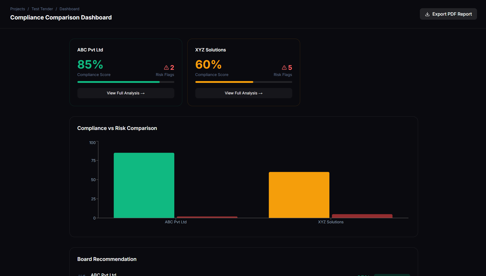
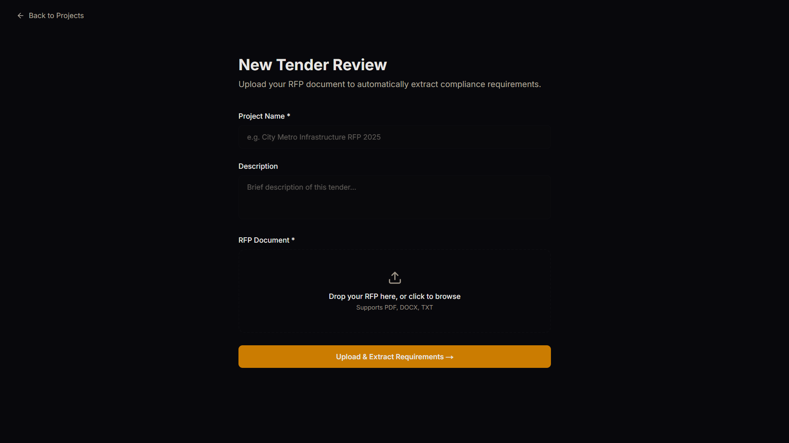
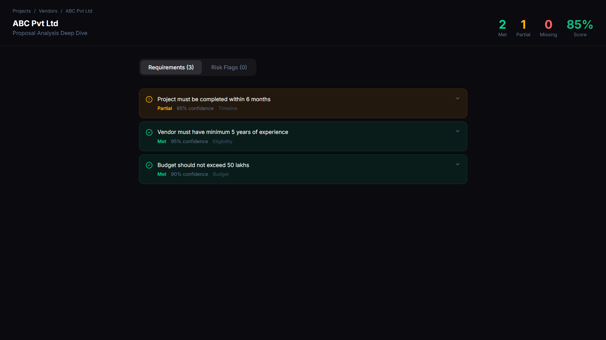
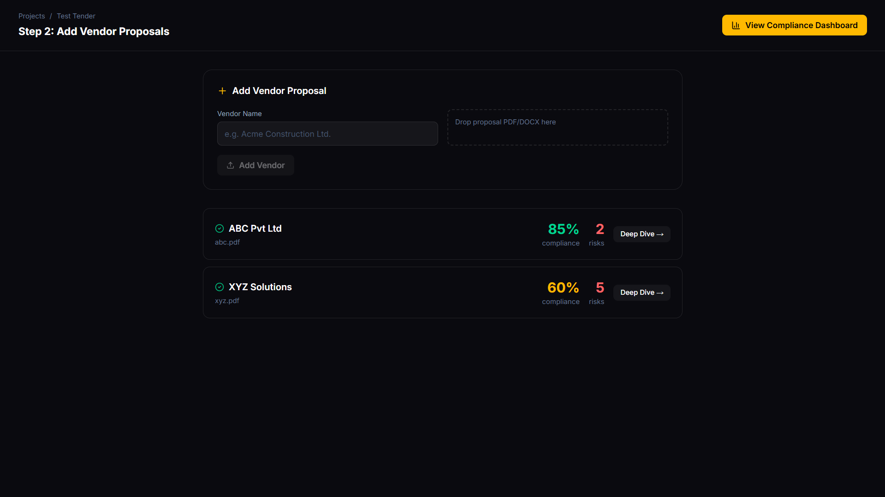

# 🚀 Tender Validator

## 🚀 Overview

Tender Validator streamlines the process of evaluating vendor proposals against RFP requirements. It enables teams to upload tender documents, extract structured requirements, analyze vendor submissions, and generate compliance scores with risk insights — all in one platform.

---

## ✨ Features

### 📂 Project & RFP Management
- Create and manage tender projects
- Upload RFP documents (PDF, DOCX, TXT)
- Automatic requirement extraction pipeline

### 📋 Requirements Processing
- Structured requirement storage
- Review and confirmation workflow

### 👥 Vendor Proposal Handling
- Upload and manage vendor submissions
- Track proposal status and metadata

### 🔍 Compliance Analysis
- Requirement-to-vendor matching
- Confidence scoring and explanations
- Risk flag detection system

### 📊 Dashboard & Insights
- Vendor comparison charts
- Compliance scoring and ranking
- Risk visualization

### 📄 Reporting
- Export structured PDF reports for decision-making

### 🔐 Secure Architecture
- Supabase Storage for file handling
- Server-side operations using Service Role
- Protected API routes

---

## 🖼️ Screenshots

### 📊 Dashboard


### 🆕 New Tender Upload


### 📋 Requirements View


### 👥 Vendor Proposals


---

## 🏗️ Tech Stack

| Category          | Technology                  |
|-------------------|-----------------------------|
| **Frontend**      | Next.js (App Router), React, Tailwind CSS |
| **Backend**       | Next.js API Routes          |
| **Database & Storage** | Supabase          |
| **Charts**        | Recharts                    |
| **PDF Generation**| jsPDF + autoTable           |
| **Language**      | TypeScript                  |

---


## 🧠 How It Works

1. **Upload RFP**
   - Document is uploaded and parsed

2. **Extract Requirements**
   - Requirements are structured and stored in database

3. **Upload Vendor Proposals**
   - Vendor documents are processed

4. **Analyze & Match**
   - Requirements mapped to vendor responses
   - Compliance scores and risks generated

5. **Visualize Results**
   - Dashboard provides comparison insights and rankings

---

## ⚙️ Setup Instructions

### 1. Clone the repository
```bash
git clone https://github.com/yourusername/tender-validator.git
cd tender-validator
```

### 2. Install dependencies
```bash
npm install
```

### 3. Setup environment variables
Create a `.env.local` file:

```env
NEXT_PUBLIC_SUPABASE_URL=your_supabase_url
NEXT_PUBLIC_SUPABASE_ANON_KEY=your_anon_key
SUPABASE_SERVICE_ROLE_KEY=your_service_role_key
```

⚠️ **Important Security Notes:**
- Never expose `SUPABASE_SERVICE_ROLE_KEY` to the frontend
- Ensure `.env.local` is in `.gitignore`

### 4. Run the development server
```bash
npm run dev
```

Open: [http://localhost:3000](http://localhost:3000)

---

## 📌 Current Status

✅ **Core system complete**  
✅ **End-to-end workflow functional**  
✅ **Dashboard and vendor analysis working**

## 🔮 Future Improvements

- AI-powered automatic requirement matching
- Advanced scoring algorithms
- Enhanced risk detection
- UI/UX refinements

---

## 🛡️ License

[MIT License](LICENSE)